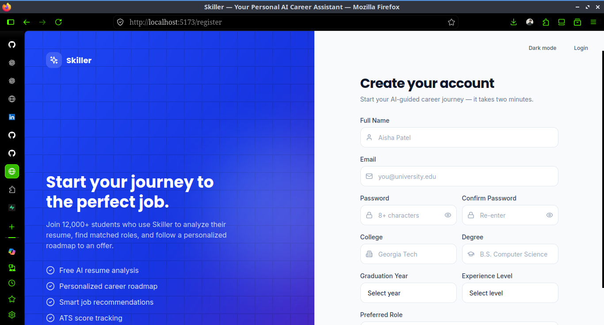
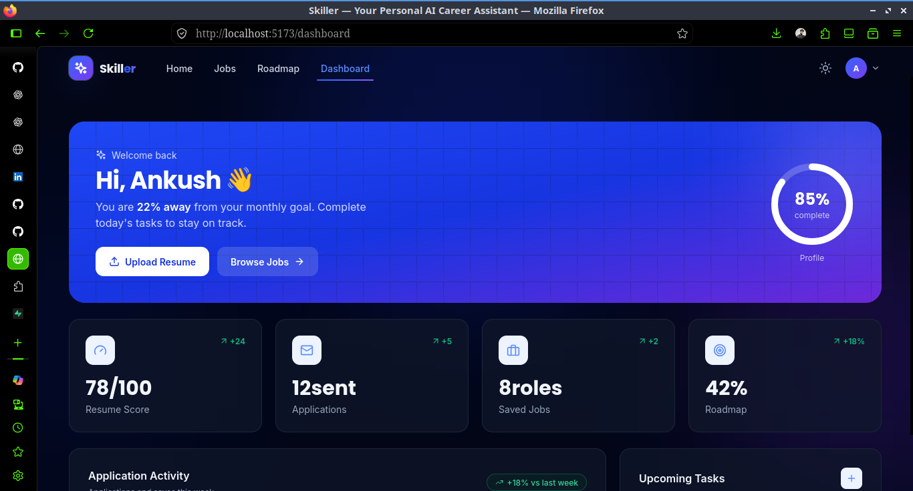
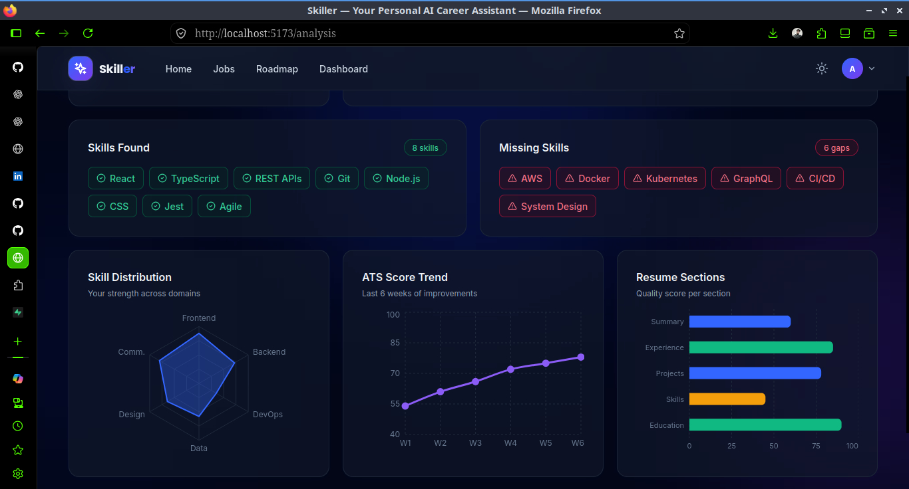
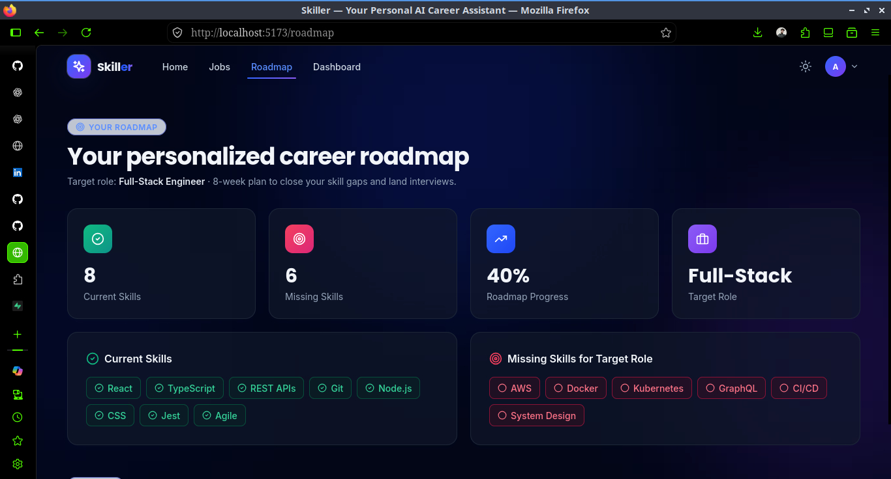

# Skiller — AI-Powered Career & Job Analysis Platform

Skiller is an AI-powered career analysis and job discovery platform designed to help students, fresuh graduates, and job seekers understand how well their skills match a target role, identify skill gaps, improve their resumes, and discover relevant job opportunities.

Instead of simply showing job listings, Skiller analyzes a user's resume and skills to provide a more personalized view of their career readiness.

---

## 🚀 What is Skiller?

Finding a job is not only about having a resume. Job seekers also need to understand:

* What skills do they currently have?
* Which skills are missing for their target role?
* How well does their resume match the desired position?
* How can they improve their resume?
* What career direction should they consider?
* Which available jobs are relevant to their current profile?

Skiller brings these capabilities together into a single platform.

### Core Flow

```text
Resume / Skills
       ↓
Resume Text Extraction
       ↓
Skill Extraction
       ↓
Target Role Analysis
       ↓
ATS-Style Resume Analysis
       ↓
Skill Gap Identification
       ↓
AI-Powered Career Feedback
       ↓
Relevant Job Discovery
```

---

# ✨ Key Features

## 📄 Resume Analysis

Users can upload their resume and allow Skiller to extract relevant information automatically.

The system processes the uploaded resume and identifies information useful for career analysis.

### Supported workflow

* Upload resume
* Extract resume text
* Identify technical and professional skills
* Analyze the profile against a target role
* Generate career insights

---

## 🎯 Target Role Analysis

Users can specify the role they are targeting.

For example:

```text
Target Role:
Machine Learning Engineer
```

Skiller then uses the user's extracted skills to identify how closely their current profile aligns with the selected career direction.

---

## 🧠 Skill Extraction

Skiller automatically extracts skills from resume content.

Extracted skills can be categorized and associated with information such as:

* Skill name
* Category
* Source
* Confidence

Example:

```text
Python        → Programming
Pandas        → Data Science
Scikit-learn  → Machine Learning
FastAPI       → Backend Development
React         → Frontend Development
```

This creates a structured representation of the user's technical profile.

---

## 📊 ATS-Style Resume Score

Skiller provides an ATS-style score to help users understand how effectively their resume represents their profile for the selected career direction.

The analysis can highlight areas that may need improvement, helping users make their resume more relevant and structured.

> The score is intended as an analytical indicator rather than a representation of the scoring system used by every individual company's ATS.

---

## 🔍 Skill Gap Analysis

Skiller compares the user's existing skills with the skills relevant to their target role.

The dashboard makes the difference easy to understand:

```text
Current Skills
    ↓
Skills already present in the profile

Missing Skills
    ↓
Skills that could strengthen the profile
```

This helps users identify what they should focus on learning next.

---

## 🤖 AI-Powered Career Insights

Skiller uses the Grok API to generate personalized career feedback based on the user's profile and analysis.

The AI-generated section can provide:

* Career suggestions
* Profile insights
* Resume improvement suggestions
* Skill-development recommendations
* Personalized summary

The goal is to turn raw resume analysis into actionable career guidance.

---

## 💼 Job Discovery

Skiller also connects career analysis with real job opportunities.

Instead of keeping job data hardcoded, the application retrieves job listings through an external job API and presents normalized job information to the frontend.

Each job can include information such as:

* Job title
* Company
* Location
* Job type
* Salary information when available
* Job description/snippet
* Source
* Last updated information
* Application link

---

## 🔎 Relevant Job Listings

Job listings are presented through a dedicated job discovery interface so users can move from:

```text
Analyze Profile
      ↓
Identify Skill Gaps
      ↓
Explore Relevant Jobs
      ↓
Apply
```

This connects career preparation with actual employment opportunities.

---

# 🖥️ Application Dashboard

The dashboard brings the major parts of the analysis together.

It provides visibility into:

* ATS-style score
* Current skills
* Missing skills
* AI-generated career feedback
* Career suggestions
* Resume improvement recommendations
* Job discovery

The interface is designed to make the user's career profile understandable at a glance.

---

# 🏗️ System Architecture

Skiller follows a frontend-backend architecture.

```text
                    ┌─────────────────────┐
                    │       User          │
                    │ Resume + Target Role│
                    └──────────┬──────────┘
                               │
                               ▼
                    ┌─────────────────────┐
                    │   React Frontend    │
                    │                     │
                    │ Dashboard           │
                    │ Resume Upload       │
                    │ Skill Analysis      │
                    │ Job Discovery       │
                    └──────────┬──────────┘
                               │
                         REST API
                               │
                               ▼
                    ┌─────────────────────┐
                    │    FastAPI Backend  │
                    │                     │
                    │ Resume Processing   │
                    │ Skill Extraction    │
                    │ Career Analysis     │
                    │ Job API Integration │
                    └──────┬──────┬───────┘
                           │      │
                ┌──────────┘      └─────────────┐
                ▼                                ▼
       ┌────────────────┐              ┌────────────────┐
       │   Grok API     │              │   Jooble API   │
       │ AI Feedback    │              │ Job Listings   │
       └────────────────┘              └────────────────┘
```

---

# 🛠️ Tech Stack

## Frontend

* React
* JavaScript
* HTML5
* CSS3

## Backend

* Python
* FastAPI
* REST APIs

## AI / Data Processing

* Python-based resume processing
* Skill extraction
* Text processing
* Grok API for AI-generated career insights

## Job Data

* Jooble API

## Development Tools

* Git
* GitHub
* VS Code
* Linux
* Python virtual environment

---

# 📂 Project Structure

The project is organized into separate frontend and backend components.

```text
Skiller/
│
├── frontend/
│   ├── src/
│   ├── public/
│   ├── package.json
│   └── ...
│
├── backend/
│   ├── extract_text.py
│   ├── skill_extractor.py
│   ├── supabase_client.py
│   ├── test_skills.py
│   └── ...
│
├── README.md
└── ...
```

> The exact frontend structure may vary depending on the current implementation. The important backend modules include resume text extraction and skill extraction.

---

# 🔄 How Skiller Works

## Step 1 — Upload Resume

The user uploads a resume containing their education, experience, projects, and skills.

```text
Resume.pdf
    ↓
Upload
```

## Step 2 — Extract Resume Text

The backend processes the resume and extracts readable text from it.

```text
PDF Resume
    ↓
Text Extraction
    ↓
Structured Resume Content
```

## Step 3 — Extract Skills

The extracted content is analyzed to identify relevant skills.

```text
Resume Content
      ↓
Skill Extraction
      ↓
Structured Skills
```

## Step 4 — Select Target Role

The user specifies the career role they want to pursue.

```text
Example:

Target Role:
Data Scientist
```

## Step 5 — Analyze Skill Gap

Skiller compares the user's existing profile against the requirements associated with the target direction.

```text
User Skills
     +
Target Role
     ↓
Skill Gap Analysis
     ↓
Current Skills + Missing Skills
```

## Step 6 — Generate Career Insights

The profile information is passed to the AI layer to generate personalized feedback.

```text
Profile + Analysis
       ↓
     Grok API
       ↓
Career Suggestions
Resume Improvements
AI Summary
```

## Step 7 — Discover Jobs

The application retrieves job listings and presents them to the user.

```text
Job API
   ↓
Job Data
   ↓
Skiller
   ↓
Relevant Job Listings
```

---

# 🔌 API

The backend exposes REST endpoints for communication with the frontend.

### Jobs Endpoint

```http
GET /api/jobs
```

The endpoint retrieves job information and returns normalized job data to the frontend.

Example response structure:

```json
{
  "id": "job-id",
  "title": "Machine Learning Engineer",
  "location": "India",
  "snippet": "Job description...",
  "salary": "Not specified",
  "source": "Jooble",
  "type": "Full-time",
  "link": "https://example.com/job",
  "company": "Example Company",
  "updated": "2026-09-30"
}
```

---

# 🔐 Environment Variables

API credentials should never be committed directly to the repository.

Create a `.env` file in the backend according to the project's configuration.

Example:

```env
GROK_API_KEY=your_grok_api_key
JOOBLE_API_KEY=your_jooble_api_key
```

Add `.env` to `.gitignore`:

```gitignore
.env
__pycache__/
*.pyc
node_modules/
```

> Never publish real API keys to GitHub.

---

# ⚙️ Local Setup

## Prerequisites

Make sure the following are installed:

* Python 3.x
* Node.js
* npm
* Git

---

## 1. Clone the Repository

```bash
git clone https://github.com/ank737/Skiller.git
cd Skiller
```

---

## 2. Set Up the Backend

Navigate to the backend directory:

```bash
cd backend
```

Create a virtual environment:

```bash
python3 -m venv venv
```

Activate it on Linux/macOS:

```bash
source venv/bin/activate
```

Install dependencies:

```bash
pip install -r requirements.txt
```

Configure the required environment variables in `.env`.

---

## 3. Start the FastAPI Backend

From the backend directory:

```bash
uvicorn main:app --reload
```

The backend will normally be available at:

```text
http://127.0.0.1:8000
```

FastAPI's interactive API documentation can be accessed at:

```text
http://127.0.0.1:8000/docs
```

---

## 4. Start the Frontend

Open another terminal and navigate to the frontend directory:

```bash
cd frontend
```

Install dependencies:

```bash
npm install
```

Start the development server:

```bash
npm run dev
```

Open the URL shown by Vite in the terminal.

---

# 🧪 Testing

The backend includes testing utilities for validating skill extraction and related functionality.

For example:

```bash
python test_skills.py
```

Testing should be performed with representative resumes containing different combinations of technical and professional skills.

---

# 📸 Pictures

## Sign-Up



## Landing / Home Page


## Career Analysis Dashboard



## Skill Gap Analysis




## AI Career Insights



---

# 💡 Why I Built Skiller

Many students and fresh graduates know several technologies but still struggle to answer important career questions:

> "What should I learn next?"

> "Is my resume relevant for the role I want?"

> "Which skills am I missing?"

> "Which jobs actually match my current profile?"

Skiller was built to bring these questions into one workflow instead of making users depend on multiple disconnected tools.

The project combines resume processing, skill extraction, career analysis, AI assistance, and job discovery into a single application.

---

# 🎯 Project Goals

Skiller is designed around four main goals:

### 1. Understand the User

Extract meaningful skills and information from the user's resume.

### 2. Identify Career Gaps

Compare the current skill profile with a desired career direction.

### 3. Provide Actionable Feedback

Use AI-generated insights to suggest areas for improvement.

### 4. Connect Analysis to Opportunities

Allow users to discover real job listings after understanding their profile.

---

# 🔮 Future Improvements

Possible future improvements include:

* More advanced semantic skill matching
* Improved job-to-skill matching
* Better resume parsing for different resume formats
* Personalized learning recommendations
* Job recommendation ranking
* More career-role templates
* Resume optimization for specific job descriptions
* Application tracking
* Career progress tracking
* Additional job sources
* More detailed analytics

---

# 📈 Project Highlights

* Full-stack career analysis platform
* React-based interactive frontend
* FastAPI REST backend
* Automated resume text extraction
* Skill extraction and categorization
* Target-role skill gap analysis
* ATS-style resume analysis
* AI-powered career feedback using Grok API
* Real job discovery using Jooble API
* Modular frontend/backend architecture
* Designed around a practical student and graduate career problem

---

# 🧑‍💻 Development Focus

The project demonstrates practical experience across:

```text
Frontend Development
        ↓
React + JavaScript + HTML + CSS

Backend Development
        ↓
Python + FastAPI + REST APIs

AI Integration
        ↓
Grok API + Career Analysis

Data Processing
        ↓
Resume Parsing + Skill Extraction

External API Integration
        ↓
Jooble Job API
```

---

# 📌 Project Status

**Active Development**

Skiller is being continuously improved with additional career-analysis, matching, and recommendation capabilities.

---

# 👨‍💻 Author

**Ankush**

B.Tech Information Technology Student
AI/ML Enthusiast

GitHub: `ank737`

---

## ⭐ If You Find This Project Interesting

Feel free to explore the repository, try the project locally, and share feedback or suggestions for improvement.
